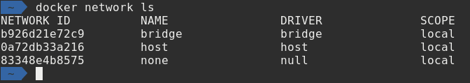
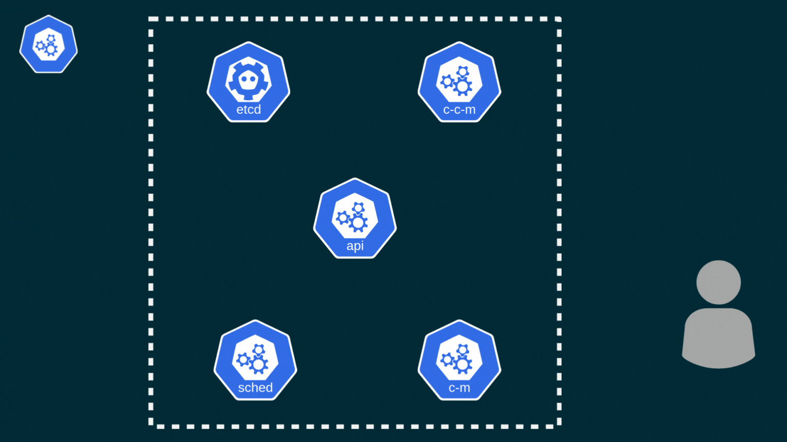
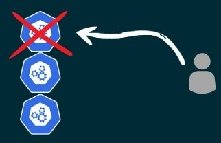
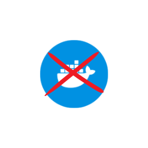

# Containers to Kubernetes

---

## Andrew Pruski

### Principal Field Solutions Architect
#### Microsoft Data Platform MVP
#### Docker Captain
#### VMware vExpert

<!-- .slide: style="text-align: left;"> -->
<i class="fa-brands fa-bluesky"></i><a href="https://bsky.app/profile/dbafromthecold.com">  @dbafromthecold.com</a> 
<i class="fas fa-envelope"></i>  dbafromthecold@gmail.com 
<i class="fab fa-wordpress"></i>  www.dbafromthecold.com 
<i class="fab fa-github"></i><a href="https://github.com/dbafromthecold">  github.com/dbafromthecold</a>

---

# Containers

---

## Agenda
<!-- .slide: style="text-align: left;"> -->
- Isolation 
- Networking 
- Persisting data 
- Custom images 
- Docker Compose 

---

# Isolation

---

## Container Isolation
<!-- .slide: style="text-align: left;"> -->
"Containers isolate software from its environment and ensure that it works uniformly despite differences for instance between development and staging" 
<a href="https://www.docker.com/resources/what-container">docker.com/resources/what-container</a>

---

## Control Groups
<!-- .slide: style="text-align: left;"> -->
Ensures a single container cannot consume all 
resources of the host 
 
Implements resource limiting of:-
- CPU
- Memory

---

## Namespaces
<!-- .slide: style="text-align: left;"> -->
Control what a container can see 
 
Used to control:- 
- Hostname within the container
- Processes that the container can see
- Mapping users in the container to users on the host

---

## File system
<!-- .slide: style="text-align: left;"> -->
- Containers cannot see the entire host's filesystem 
- They can only see a subset of that filesystem 
- The container root directory is changed

---

# Demo

---

# Networking

---

## Default networks
<!-- .slide: style="text-align: left;"> -->

- bridge 
- host 
- none 

---

## Bridge network
<!-- .slide: style="text-align: left;"> -->
- Default network 
- Represents _docker0_ network 
- Containers communicate by IP address 
- Supports port mapping 

---

## User defined networks
<!-- .slide: style="text-align: left;"> -->
- Docker provide multiple drivers 
- DNS resolution of container names to IP addresses 
- Can be connected to more than one network 
- Connect/disconnect from networks without restarting 

---

# Demo

---

# Persisting data

---

## Options for persisting data
<!-- .slide: style="text-align: left;"> -->
- Bind mounts 
- Data volume containers 
- Named volumes

---

# Demo

---

# Custom images

---

## Building your own image
<!-- .slide: style="text-align: left;"> -->
- Custom images built from a file 
- Known as a dockerfile 
- Customise the image to grant permissions 
- Add databases to SQL Server 

---

## Dockerfile

<pre><code data-line-numbers="1|3|5-8|10|12|14">FROM mcr.microsoft.com/mssql/server:2019-CU5-ubuntu-18.04

USER root

RUN mkdir /var/opt/sqlserver
RUN mkdir /var/opt/sqlserver/sqldata
RUN mkdir /var/opt/sqlserver/sqllog
RUN mkdir /var/opt/sqlserver/sqlbackups

RUN chown -R mssql /var/opt/sqlserver

USER mssql

CMD /opt/mssql/bin/sqlservr
</pre></code>

---

# Demo

---

# Docker Compose

---

## Docker container run

<pre><code data-line-numbers="1|2|3-8|9|10-13|14|15">docker container run -d
--publish 15789:1433
--env SA_PASSWORD=Testing1122
--env ACCEPT_EULA=Y
--env MSSQL_AGENT_ENABLED=True
--env MSSQL_DATA_DIR=/var/opt/sqlserver/sqldata
--env MSSQL_LOG_DIR=/var/opt/sqlserver/sqllog
--env MSSQL_BACKUP_DIR=/var/opt/sqlserver/sqlbackups
--network sqlserver
--volume sqlsystem:/var/opt/mssql
--volume sqldata:/var/opt/sqlserver/sqldata
--volume sqllog:/var/opt/sqlserver/sqllog
--volume sqlbackup:/var/opt/sqlserver/sqlbackups
--name sqlcontainer1
mcr.microsoft.com/mssql/server:2019-CU5-ubuntu-18.04
</pre></code>

---

## What is Compose?
<!-- .slide: style="text-align: left;"> -->
"Compose is a tool for defining and running multi-container Docker applications.
With Compose, you use a YAML file to configure your application`s services.
Then, with a single command, you create and start all the services from your configuration." 
<a href="https://docs.docker.com/compose/">docs.docker.com/compose</a>

---

# Demo

---

# Kubernetes

---

# Kubernetes Nodes
<!-- .slide: style="text-align: left;"> -->

---

### Node Types
<!-- .slide: style="text-align: left;"> -->

Two different types of Kubernetes nodes: -

  

    

      Control Nodes
    

    
  

  

 <!-- Adjust the width to control the spacing -->
  

    

      Worker Nodes
    

    
  

---

# Control Nodes
<!-- .slide: style="text-align: left;"> -->

---

### Control Node
<!-- .slide: style="text-align: left;"> -->

---

### Control Node Components
<!-- .slide: style="text-align: left;"> -->

Managing the cluster: -
<ul>
  <li class="fragment">kube-apiserver</li>
  <li class="fragment">etcd</li>
  <li class="fragment">kube-scheduler</li>
  <li class="fragment">kube-controller-manager</li>
  <li class="fragment">cloud-controller-manager</li>
</ul>

---

### The API Server
<!-- .slide: style="text-align: left;"> -->

RESTful API endpoint: -
- The control plane front end
- Authentication and Authorisation
- Validates incoming requests
- Manages lifecycle of Kubernetes resources

---

### ETCD
<!-- .slide: style="text-align: left;"> -->

A distibuted key value store: -
- A consistent cluster view
- Persist cluster state
- High availability and scalability
- Backup and restore

---

### Kube-Scheduler
<!-- .slide: style="text-align: left;"> -->

Selects nodes to run pods: -
- Evaluates nodes in cluster
- Implements scheduling policies
- Resource allocation
- Load Balancing

---

### kube-controller-manager
<!-- .slide: style="text-align: left;"> -->

Runs the controller processes: -
- Node controller
- Namespace Controller
- Service Controller
- StatefulSet Controller

---

### Control Node High Availability
<!-- .slide: style="text-align: left;"> -->

Control Plane HA is a must!
- Multiple control nodes
- Load balancing across nodes
- Etcd cluster
- Managed K8s clusters

---

# Worker Nodes

---

### Worker Node Components
<!-- .slide: style="text-align: left;"> -->

Running applications: -
<ul>
  <li class="fragment">kube-proxy</li>
  <li class="fragment">kubelet</li>
  <li class="fragment">container runtime</li>
</ul>

---

### Kube-proxy
<!-- .slide: style="text-align: left;"> -->

Maintains network rules on nodes: -
- Communication between pods and services
- Service discovery
- Endpoint monitoring
- Uses IP tables (or IPVS)

---

### Kubelet
<!-- .slide: style="text-align: left;"> -->

Lifecycle management of pods: -
- Interacts with the container runtime
- Monitors node utilisation
- Containers are running and healthy

---

### Container Runtime
<!-- .slide: style="text-align: left;"> -->

Interacts with the kubelet to: -
- Manage the lifecycle of containers
- Pull images from registry
- Provides isolation
- Used to be Docker

---

### Why no longer Docker?
<!-- .slide: style="text-align: left;"> -->

 

- Docker support hardcoded
- Added support for other runtimes
- Implementation of the CRI
- Dockershim no longer needed

---

# Demo
<!-- .slide: style="text-align: left;"> -->

---

# Deploying Applications
<!-- .slide: style="text-align: left;"> -->

---

### Daemonsets
<!-- .slide: style="text-align: left;"> -->

Runs a pod on every node in the cluster: -
- Log collection
- Monitoring
- Not really a use case for SQL Server!

---

### Deployments
<!-- .slide: style="text-align: left;"> -->

Declarative method to spin up applications: -
- Desired state in yaml file
- Self-healing
- Easy updates and rollbacks
- Typically for stateless apps

---

### Statefulsets
<!-- .slide: style="text-align: left;"> -->

Valuable for applications requiring: -
- Unique network identifiers
- Persistent storage
- Graceful deployment and scaling
- Ordered rolling updates

---

# Demo
<!-- .slide: style="text-align: left;"> -->

---

# Controlling high availability
<!-- .slide: style="text-align: left;"> -->

---

### Pod Eviction Timings

<pre><code data-line-numbers="1-9|2-5|6-9">tolerations:
- key: "node.kubernetes.io/unreachable"
  operator: "Exists"
  effect: "NoExecute"
  tolerationSeconds: 10
- key: "node.kubernetes.io/not-ready"
  operator: "Exists"
  effect: "NoExecute"
  tolerationSeconds: 10
</pre></code>

---

# Persisting Data
<!-- .slide: style="text-align: left;"> -->

---

### Persisting Data
<!-- .slide: style="text-align: left;"> -->

  

    

      Storage Classes
    

    
  

  

    

      Persistent Volumes
    

    
  

  

    

      Persistent Volume Claims
    

    
  

---

# Demo
<!-- .slide: style="text-align: left;"> -->

---

### Resources
<!-- .slide: style="text-align: left;"> -->

<a href="https://github.com/dbafromthecold/containers2kubernetes">https://github.com/dbafromthecold/containers2kubernetes</a> 

  

